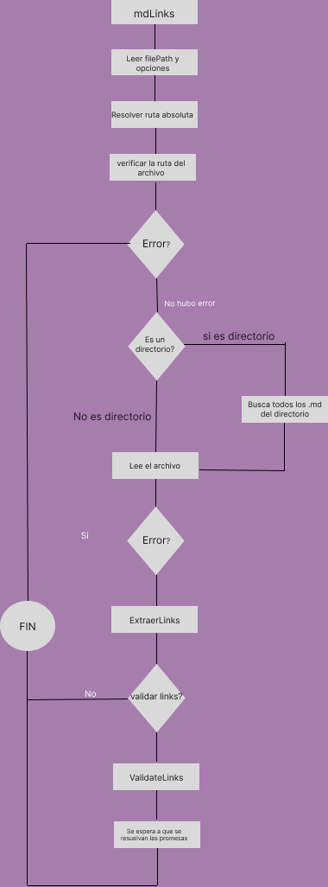

# Markdown Links
## Diagrama de flujo


## mdLinks

mdLinks es una librería de Node.js que te permite extraer y validar enlaces en archivos Markdown.

## 2. Instalación

Para utilizar mdLinks, primero debes instalarlo como una dependencia en tu proyecto de Node.js. Puedes hacerlo ejecutando el siguiente comando en tu terminal:

npm install md-links

## Uso

mdLinks se puede utilizar tanto desde la línea de comandos como desde otros scripts de Node.js. A continuación, se muestran ejemplos de cómo usar la librería:

Desde la línea de comandos

md-links <path-to-file> [--validate] [--stats]

<path-to-file>: Ruta al archivo Markdown que deseas analizar.
--validate (opcional): Realiza la validación de los enlaces encontrados.
--stats (opcional): Muestra estadísticas de los enlaces encontrados.

Desde un script de Node.js:

```javascript
const mdLinks = require('md-links');

mdLinks(filePath, options)
  .then(links => {
    // Aquí puedes trabajar con los enlaces
    console.log(links);
  })
  .catch(error => {
    // Manejo de errores
    console.error(error);
  });
  ```

filePath: Ruta al archivo Markdown que deseas analizar.
options (opcional): Un objeto con opciones adicionales.
validate: Booleano que indica si se debe realizar la validación de los enlaces.

## Documentación de la API

mdLinks(filePath, options)
Esta función lee el archivo Markdown especificado, extrae los enlaces y los devuelve como un array de objetos. Cada objeto de enlace tiene las siguientes propiedades:

-href: La URL del enlace.

-text: El texto del enlace.

-file: La ruta del archivo que contiene el enlace.

-filePath: Ruta al archivo Markdown que se desea analizar.

-options (opcional): Un objeto con opciones adicionales.

-validate: Booleano que indica si se debe realizar la validación de los enlaces.
La función devuelve una promesa que se resuelve con el array de enlaces.

### printLinks(links, isValidated)
Esta función imprime los enlaces en la consola. Recibe dos parámetros:

links: Array de enlaces.
isValidated: Booleano que indica si los enlaces están validados.
Si isValidated es true, la función muestra información adicional sobre el estado y el texto de cada enlace.

### PrintStates (links)

Esta función imprime estadísticas de los enlaces en la consola. Recibe un parámetro:

links: Array de enlaces.
La función muestra el total de enlaces, el número de enlaces únicos y el número de enlaces rotos.

### getUniqueLinks (links)

Esta función recibe un array de enlaces y devuelve el número de enlaces únicos. No se tienen en cuenta duplicados basados en la URL del enlace.

### getBrokenLinks(links)

Esta función recibe un array de enlaces y devuelve el número de enlaces rotos. Se consideran enlaces rotos aquellos que tienen un estado de fallo (fail).

## Ejemplos
```javascript
const mdLinks = require('md-links');

mdLinks('path/to/file.md')
  .then(links => {
    printLinks(links, false);
  })
  .catch(error => {
    console.error(error);
  });
```
  
  ### Ejemplo 2: Obtener enlaces con validación
```javascript
  const mdLinks = require('md-links');

mdLinks('path/to/file.md', { validate: true })
  .then(links => {
    printLinks(links, true);
  })
  .catch(error => {
    console.error(error);
  });
  ```

### Ejemplo 3: Obtener estadísticas de los enlaces

```javascript
const mdLinks = require('md-links');

mdLinks('path/to/file.md')
  .then(links => {
    printStats(links);
  })
  .catch(error => {
    console.error(error);
  });
```

Esperamos que esta documentación te sea útil para utilizar mdLinks en tus proyectos. Si tienes alguna pregunta o problema, no dudes en abrir un issue en el repositorio de GitHub. ¡Gracias por usar mdLinks!